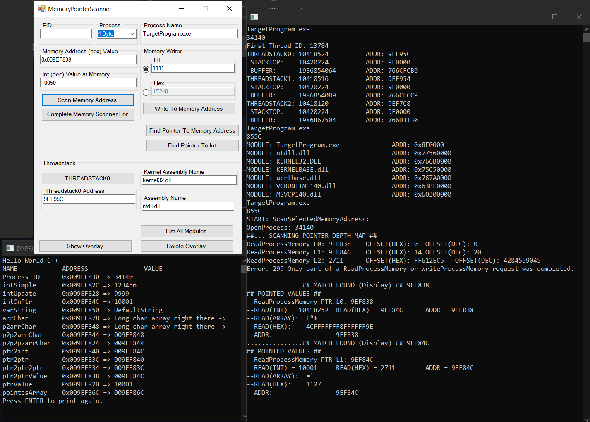

# Memory-Scanner
Simple memory pointer scanner and memory writer

<< This is simple memory scanning program I made to learn C++, pointers and memory.

## Functionality:
* Scan memory address value.
* If pointer is on memory address scan in depth until no pointer exists and show pointed value.
* Write value as int or hex to memory address.
* Get THREADSTACK0 address.
* List all loaded modules and its addresses.
* Find pointer to integer from whole computer memory.
* Find pointer to memory address.

## Screenshot

